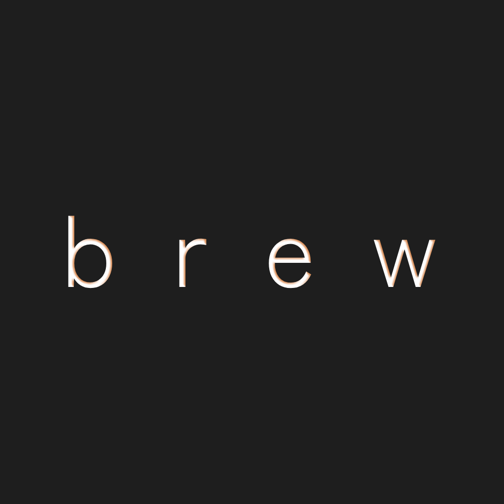

# ☕ Brew

<table>
  <tr>
    <td width="200">
      
    </td>
    <td>
      <p>
        <b>Brew</b> is a stylish Android app for coffee enthusiasts, created with Jetpack Compose.
        Discover a handpicked coffee collection, check out brewing guides, and find local cafés 
        with live location tracking, all wrapped in a sleek, user-friendly interface.
      </p>
    </td>
  </tr>
</table>

---

## 🖼️ Screenshots

<table>
  <tr>
    <td align="center"><b>Homepage</b></td>
    <td align="center"><b>Liked Coffees</b></td>
    <td align="center"><b>Search Bar</b></td>
  </tr>
  <tr>
    <td></td>
    <td></td>
    <td></td>
  </tr>
  <tr>
    <td align="center"><b></b></td>
    <td align="center"><b>Coffee Details</b></td>
    <td align="center"><b></b></td>
  </tr>
  <tr>
    <td></td>
    <td></td>
    <td></td>
  </tr>
</table>

---

## 🎥 Demo Video

<a href="https://vimeo.com/1100120044">
  
</a>

> 📹 A quick walkthrough of the app, including search, favourites, coffee details, and café integration.

---

## ⚙️ Tech Stack

- **Kotlin**, **Jetpack Compose**, **MVVM**
- **Hilt** for dependency injection
- **Retrofit** for API calls
- **Spring Boot** backend with **WebFlux**
- **Room** for local persistence (liked coffees)
- **Geoapify Places API**
- Hosted with **Render**
- Auto-wake using **cron-job.org**

---

## 🛠️ Setup Guide

### Android App

1. Clone the repo:
   ```bash
   git clone https://github.com/AntoOfo/brew-app
   cd brew-app
    ```
2. Open the project in Android Studio.

3. Let Gradle sync and build.

4. Run the app on an emulator or physical device.

### Backend (Spring Boot)

1. The backend is located in the brew-backend/ folder.

2. You'd need Java 22 and a valid Geoapify API key in **application.properties:**
   ```bash
   geoapify.api.key=YOUR_API_KEY
    ```
3. Host it on **Render** or run it locally.

---

## 📁 License

Licensed under the MIT License.
